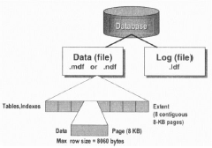
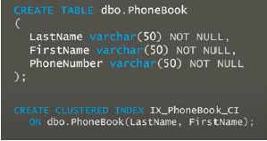
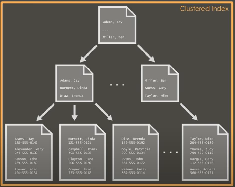

# H5 - Indexes and Performance | [BACK](../README.md)

## Space allocation by SQL Server

- Random access files
- Page → 8 kB blok aaneengesloten geheugen
- Extent → 8 logisch opeenvolgende pagina's
    - uniform extends: voor 1 DB-object
    - mixed extents: kan gedeeld worden met 8 db objecten(=tabellen, indexes, enz.)

→ een extent is een groep van 8 pagina's en een pagina is een block data van 8 kB

→ nieuwe data wordt toegevoegd aan een mixed extent



## Creation of indexes

```sql
CREATE [UNIQUE] [| NONCLUSTERED]
INDEX index_name ON table (kolom [,...n])
```

- Unique: alle waarden in de geïndexeerde kolom moeten uniek zijn
    - Kolom met unieke index mag niet null zijn
- Wanneer je een index aanmaakt kan de tabel leeg of gevuld zijn

## Removing indexes

```sql
DROP INDEX index_name ON table
```

## Table scan

- Heap
    - Niet gesorteerde collectie van data-pages
        - geen index
    - Standaard manier van opslaan tabel zonder indexen

- Toegang door Index Allocation Map
- Table scan: gaat alle pages van de tabel ophalen om door te zoeken
- Performantie probleem:
    - Fragmentatie:
        - Tabel verspreid over meerdere niet opvolgende pagina's
    - Forward pointers
        - varchar velden kunnen langer worden bij een update → een forward pointer is een verwijzing naar een andere
          pagina → **TRAAG**

1. Steek de ongesorteerde data in een tabel
    1. Zeer inefficiënt: stel je zoekt een telefoonnummer op, dan moet je alle rijen doorlopen omdat er later misschien
       nog een match is met dat nummer.
    2. Niet altijd slecht: Als je bv. veel data nodig hebt, dan is het niet zo erg dat je alles moet doorlopen.
2. Probeer de data te sorteren
    1. In een telefoon boek staan alle nummers gesorteerd op achternaam, op voornaam als er meerdere mensen dezelfde
       achternaam hebben.
    2. Dit lost het probleem niet op → soortgelijke scan maar weet nu wel waar te stoppen met zoeken

## Clustered index

- Boom structuur
    - Zoeken door deze boom:
        - **Clustered index seek**
        - Makkelijk navigeren door de boom naar juiste data → efficient
- Data wordt gesorteerd op de geïndexeerde kolom
- Clustered index houd de 'base table' bij in de structuur

> De bladeren van de boom zijn de base data en de knopen zijn de index data die verwijzen naar de bladeren/pages





## Non Clustered index

## Filtered index

## INCLUDE

## Clustered vs Non Clustered index

## Does my query use a table scan?

## What is the difference? Indexes!

## Indexes: library analogy

## SQL Optimizer

## Clustered index

## Non Clustered index

## Covering index

## 1 index with several columns vs several indexes with 1 column

## Use of indexes with functions and wildcards

## Index seek vs Index scan

## When to use an index?

## Tips & Tricks