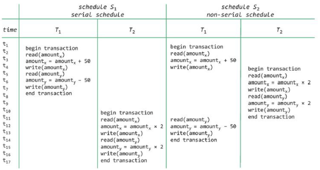

# H6 - Basics of Transaction Management | [BACK](../README.md)

## Transactions, Recovery and Concurrency Control

- Doordat je met meerdere gebruikers op een database werkt kunnen er fouten lopen in het DBMS → voorkomen ACID
  eigenschappen volgen


- ACID eigenschappen:
    - Atomicity
    - Consistency
    - Isolation
    - Durability


- Transaction:
    - een aantal database-operaties die als een eenheid worden uitgevoerd
    - faalt volledig of slaagt volledig → alle operaties worden uitgevoerd of geen enkele
    - zorgen dat de database in een consistente toestand blijft


- Mogelijke problemen:
    - harde schijf crash
    - dbms crash
    - divisie door 0

- Recovery:
    - herstel van fouten in de database na een crash
    - database moet terug in consistente toestand komen

- Concurrency Control:
    - coordinatie van verschillende transacties die tegelijkertijd op de database werken zodat inconsistenties voorkomen
      worden

## Transactions and Transaction Management

### Delineating Transactions and the Transaction Lifecycle

- Defineren van transacties:
    - impliciet: de eerste SQL statement definieert de transactie
    - expliciet: BEGIN TRANSACTION and ROLLBACK TRANSACTION / COMMIT TRANSACTION

- Transactie succesvol: COMMIT TRANSACTION
- Transactie mislukt: ROLLBACK TRANSACTION

### SP and transactions

```sql
CREATE PROCEDURE sp_Customer_Insert @customerid varchar(5), @companyname varchar(25), @orderid int OUTPUT
AS
    BEGIN TRANSACTION
        INSERT INTO customers(customerid, companyname)
    VALUES(@customerid, @companyname)
    IF @@error <> 0
        BEGIN
            ROLLBACK TRANSACTION
            RETURN -1
        END
    INSERT INTO orders(customerid)
    VALUES(@customerid)
    IF @@error <> 0
        BEGIN
            ROLLBACK TRANSACTION
            RETURN -1
        END
COMMIT TRANSACTION
SELECT @orderid = @@IDENTITY
```

### Trigger and transactions

- een trigger is deel van de transactie waarin het is gedefinieerd
    - Kan dus geroledback worden binnen de trigger

```sql
-- If a new record is inserted in OrderDetails => check if the unitPrice is not too low or too high
CREATE OR ALTER TRIGGER insertOrderDetails ON OrderDetails FOR insert
AS
DECLARE @insertedProductID INT = (SELECT ProductID From inserted)
DECLARE @insertedUnitPrice Money = (SELECT UnitPrice From inserted)
DECLARE @unitPriceFromProducts Money = (SELECT UnitPrice FROM Products WHERE ProductID = @insertedProductID)
IF @insertedUnitPrice NOT BETWEEN @unitPriceFromProducts * 0.85 AND @unitPriceFromProducts * 1.15
BEGIN
    ROLLBACK TRANSACTION
    RAISERROR ('The inserted unit price can''t be correct', 14,1)
END
```

### DBMS Components involved in Transaction Management

- **Scheduler**: bepaalt in welke volgorde operaties worden uitgevoerd
- **storeddatamanager**: zorgt dat de data opgeslagen wordt
- **Buffer manager**: waar operaties tijdelijk worden opgeslagen in RAM geheugen voor naar de harde schijf te schrijven

  

### Logfile

- Logfile registers:

    - uniek log sequentie nummer
    - iniek transactie nummer
    - Welke operatie is uitgevoerd met de tijd
    - Een referentie naar de data die is aangepast
    - **Before image**: de data waarop de transactie iets gedaan heeft voor de transactie
    - **After image** : de data waarop de transactie iets geaard heeft na de transactie
    - **Checkpoint**: punt wanneer gebufferde data naar de harde schijf wordt geschreven

- **Write ahead logging**: de logfile wordt geschreven voor de data wordt aangepast -> zorgt dat de logfile altijd
  consistent moest er een crash zijn

  

## Recovery

### Types of Failures

- Transaction failure:
    - Fout door error in de logica van de transactie
- System failure
    - Als OS of DBMS crasht
- Media failure
    - Als de persistente data beschadigd raakt of niet beschikbaar is

### System Recovery

- Bij system failure: 2 soorten transacties:

    - Committed transacties: transacties die succesvol zijn afgerond
    - Uncommitted transacties: transacties die niet succesvol zijn afgerond en nog actief waren.

- De logfile is essentieel om te weten welke transacties succesvol zijn afgerond en welke niet om zo de database te
  kunnen herstellen (UNDO en REDO)

- Database buffer flushen heeft impact op de UNDO en REDO

> Kijke opname les week 10 (1) op min 29 voor uitgebreide uitleg
> 

### Media Recovery

- Hangt af van het soort media:

    - Kan offline op tape vault of online op harddisk

- Afwegen tussen de cost van onderhoud redundante data en de tijd nodig om systeem te herstellen

- Twee soorten:
    - **Disk mirroring**
        - een real time kopie van de harde schijf (heeft constant een backup) naar 2 of meer harde schijven
    - **Archiving**
        - periodieke kopie van de harde schijf naar een ander medium
        - grote kans op data verlies -> laatste backup om 10u en om 11u crasht de harde schijf
    - Gemixte oplossing: disk mirroring + archiving
        - Archve terugzetten op de harde schijf en de rest via de logfile redo laten herstellen

## Concurrency Control

### Typical Concurrency Problems

- Scheduler is verantwoordelijk voor het correct plannen van de transacties en hun operaties
- Gewoon serieel(achter elkaar) uitvoeren is niet efficiënt

Verschillende problemen:

- **Lost Update**: Als een transactie die normaal succesvol zou zijn een record update en een andere transactie update
  hetzelfde record voor de eerste transactie klaar is.
  > 
  > Hier lezen bijde transacties de waarde 100 en werken daarop verder maar transactie 2 heeft ondertussen al
  aanpassingen gedaan die nog niet gecommit zijn waardoor 1 het verkeerde getal write naar de database
- **Dirty read**: Als een transactie een record leest dat nog niet gecommit is door een andere transactie die iets aan
  het updaten is
  > 
  > Hier schrijft transactie 2 een record net voor transactie 1 het leest maar die transactie 2 daarna volgt er een
  rollback en klopt de data die transactie 1 heeft gelezen niet meer.
- **Inconsistent analysis**: Een transactie leest gedeeltelijke resultaten van een andere transactie die tegelijkertijd
  bezig is met het updaten van dezelfde data
  > 
  > Transactie 1 is sommige waarden aan het aanpasse waar transactie 2 mee bezig is waardoor het resultaat van 2 niet
  meer klopt
- **nonrepeatable read(unrepeatable read)**: Dat T1 een rij een aantalkeer leest en telkes andere data terugkrijgt omdat
  T2 die rij heeft aangepast ondertussen
- **phantom reads**: Dat T2 een insert of delete doet op een aantal rijen die gelezen worden door T1


### Schedules and Serial Schedules

- **Schedule**: een volgorde van transacties en hun operaties bepalen. Hierbij mogen de operaties van eenzelfde
  transactie niet in een andere volgorde worden uitgevoerd.

  > stel je hebt 2 transacties
  > LEGENDE: Ox is een operatie
  >
  > ```
  > T1: O1, O2, O3
  > T2: O1, O2
  >
  > Schedule: T1_01, T2_01, T1_02, T2_02, T1_03
  > Dit is correct want bv T1_02 mag niet voor T1_01 gebeuren
  >
  > Schedule: T1_02, T1_01, T2_01, T1_03, T2_02
  > ```

- “For each transaction T that participates in a schedule S and for all statements si and sj that belong to the same
  transaction T: if statement si precedes statement sj in T, then si is scheduled to be executed before sj in S.”

- De schedules zorgt er eigenlijk voor dat de ordering binnen een transactie behouden blijft. Maar de ordering tussen
  transacties is niet belangrijk.

- **Serial schedule**: een schedule waarbij de ordering tussen transacties wel belangrijk is. Dit is niet optimaal voor
  performance. Geen parallelle uitvoering mogelijk.

  > ```
  > T1: O1, O2, O3
  > T2: O1, O2
  >
  > Schedule: T1_01, T2_01, T1_02, T2_02, T1_03
  > Serial schedule: T1_01, T1_02, T1_03, T2_01, T2_02
  > ```

### Serializable Schedules

- **Serializable schedule**: is een niet-serieel die equivalent is met een serial schedule. Dit is de beste oplossing
  voor performance en concurrency.

  

- Voor te kijken hoe een schedule serializable is kan er een graaf gemaakt worden.
    - Elke transactie heeft een node T<sub>i</sub>
    - Als T<sub>j</sub> iets leest nadat T<sub>i</sub> heeft geschreven, gerichte boog van T<sub>i</sub> naar T<sub>
      j</sub>
    - als T<sub>j</sub> iets schrijft nadat T<sub>i</sub> heeft gelezen, gerichte boog van T<sub>i</sub> naar T<sub>
      j</sub>
    - Als T<sub>j</sub> iets schrijft na dat T<sub>i</sub> heeft geschreven, gerichte boog van T<sub>i</sub> naar T<sub>
      j</sub>
    - **Als er een cykel is in de graaf is de schedule niet serializable**
        - In de foto hierboven bij S<sub>2</sub> is eer een cykel

### Optimistic and Pessimistic Schedulers

- Schedulers maken gebruik van scheduling protocollen
    - **Optimistic protocol**:
        - Gaat ervan uit dat er zelden conflicten zijn
        - Transacties worden uitgevoerd zonder delay
        - Als een transactie klaar is om te commiten → check of er geen conflicten zijn
        - Als er conflicten zijn → rollback
        - Als er geen conflicten zijn → commit
    - **Pessimistic protocol**:
        - Gaat ervan uit dat er conflicten zijn
        - Transacties operaties worden uitgevoerd met delay totdat de scheduler ze is de juiste volgorde kan uitvoeren
        - Kleinere throughput
        - Seriele schedules!

- Locking wordt gebruikt in beide protocollen:
    - Pessimistic scheduling: Locks gebruikt om simultane uitvoering van transacties te limiteren
    - Optimistic scheduling: Locks gebruikt om conflicten te detecteren
- Timestamping:
    - Read en Write timestamps worden geassocieerd met een DB-object
    - Timestamps worden gebruikt om de ordering van transacties af te dwingen

### Locking and Locking Protocols

#### Purposes of Locking

- Het doel van locking is om ervoor te zorgen dat in situaties waar verschillende gelijktijdige transacties toegang
  willen tot hetzelfde DB-object, dat toegang wordt verleend zodat er geen conflicten ontstaan.
- Lock is een variabele die geassocieerd is met een DB-object
    - houd bij welke operaties toegestaan zijn op het object op dat moment
- Lock manager verantwoordelijkheden:
    - toekennen locks
    - vrijgeven locks

- Soorten locks:
    - **exclusive lock**:
        - x-lock of write lock
        - 1 enkele transactie heeft toegang tot dat DB-object per moments
        - Nodig als een transactie iets wil updaten of verwijderen
    - **Shared lock**:
        - s-lock of read lock
        - Zorgt ervoor dat er enkel gelezen kan worden op dat DB-object
        - Meerdere transacties kunnen tegelijkertijd een s-lock op een DB-object hebben

  

- Lock table:
    - Een tabel die alle locks bijhoudt die aangevraagd zijn
- Voorkomen van starvation -> eerlijkheid van transactie bepalen

#### Two-Phase Locking Protocol (2PL)

- Werking:
    1. Een transactie kan een lock aanvragen op een DB-object
        - naargelang het soort operatie dat de transactie wil uitvoeren, vraagt de transactie een s-lock of een x-lock
    2. Lock manager → controleert of een lock kan worden toegekend
        - gebaseerd op compatibility matrix
    3. Verwerven en lossen van locks gebeurt in 2 fases
        - growth phase: Locks kunnen worden verworven maar niet lossen
        - shrink phase: Locks worden gelijkelijk losgelaten en kunnen niet meer worden verworven

- 2 Varianten:
    - Rigorous 2PL: transacties houden alle locks tot de gecommit is
    - Conservative/Static 2PL: Transacties vraagt alle locks aan aan het begin van de transactie
      

  
  

#### Cascading Rollbacks

#### Dealing with Deadlocks

#### Isolation Levels

#### Lock Granularity

## The ACID Properties of Transactions
