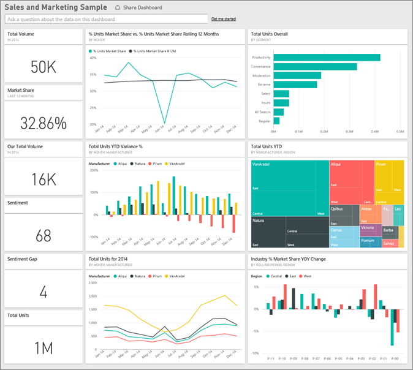

# H7 - DWH + BI | [BACK](../README.md)

## Introduction

- Er is een nood om pure data om te zetten naar werkbare informatie
    - Flexibele bedrijfs-rapportering
    - Data in DWH groeit exponentieel
        - Gesproken over terabytes

- Informatie -> wijsheid
    - Als je data op de juiste manier kan omzetten naar informatie, dan kan je wijsheid halen uit die informatie

### Business Intelligence (BI): definition

- Verzameling van technieken, processen, applicaties, data, technologies en technische architecturen die gebruikt worden
  door bedrijven om aan dat-analyse te doen
- BI voorziet historische, actuele en voorspellende inzichten in de bedrijfsactiviteiten
- Veel voorkomende functies van BI technologien:
    - Reporting
    - Analyse
    - Data mining
    - process mining
    - Complex event processing
    - Business performance management
    - Benchmarking
    - Predictive analytics
    - Text mining
    - Prescriptive analytics

### Business Intelligence (BI): another definition

- Is een overkoepelende term voor technologie dat help bedrijven organiseren en query van data om hun
  bedrijfsactiviteiten te verbeteren -> meer geld verdienen

### Drivers for increasing use of BI

- Digitalisatie:
    - ERP
    - CRM
    - PLM
    - DAM
    - PIM
    - ...

- Verbindingen tussen BI en andere systemen:
- Overvloed aan data
- Complexiteit van het bedrijfsproces
    - Je kan niet meer op gevoel afgaan
- Verbeteren van inefficiënties, onjuistheden
    - Anti excel cultuur
- Lagere kosten

### Datawarehouse: definition

- IS een geïntegreerde, onderwerp gerichte, tijdsgebonden en niet veranderlijke collectie van data waarop keuzes kunnen
  worden gemaakt op management niveau

### Properties

- Onderwerp gerichte (subject oriented)
    - Data is georganiseerd rond de hoofdonderwerpen van het bedrijf
        - Klanten, producten, leveranciers, ...
            - Niet: facturen, bestellingen, ...
    - Dit wordt gereflecteerd in de nood om ondersteunende data te hebben i.v.p applicatie data
- Geïntegreerd (integrated)
    - Data is van verschillende bronnen
        - Vaak inconsistente data
- Tijdsgebonden (time-variant)
    - De data in enkel juist op een bepaald moment
        - Er gebeuren geen updates in een DWH
            - Zie het als een geschiedenis van de data je kan reeds bestaande data niet meer aanpassen
- Niet veranderlijk (non-volatile)
    - Data is normaal niet geupdate in Real time
        - Op regelmatige basis
    - Nieuwe trend is om naar real time DWH te gaan
    - Nieuwe data is altijd toegevoegd aan de database en vervangt de oude data niet
- Aggregeerde data (aggregated data)
    - Bv: Gegenereerd door GROUP BY

- DWH is gewoon een relationele databank
    - Het verschil met gewone DB
        - Niet specifiek geimplementeerd voor een applicatie
        - Houd data van verschillende applicaties/bronnen bij
- Het bouwen van een DWH geeft je de mogelijkheid om data op te slaan zodat je er snel info van kan lezen

### OLTP vs OLAP database

- OLTP (Online Transaction Processing) -> 'normale' database
    - Online betekent gewoon dat er realtime connectie is met de database
    - Veel transacties -> veel kleine acties rond veranderen en toevoegen van data
    - Snelle processing
    - genormaliseerde data
        - minder Redundantie
        - verhoogde consistentie
    - Veel tabellen
    - EG: Wie heeft er een bestelling geplaatst voor x?
- OLAP (Online Analytical Processing) -> datawarehouse
    - Veel data
    - Trage Query
        - Lezen van grote datasets om rapporten te genereren
    - Gedenormaliseerde data
        - Maakt queries sneller door minder joins
    - Minder tabellen
    - EG: Hoeveel bestellingen zijn er geplaatst voor x?
    - Kan goed gebruik maken van indexen
        - Dit doordat indexen goed zijn voor door grote hopen data te lezen en niet voor schrijven

### Why build a DWH?

- Performantie problemen
    - 
- Kwaliteit problemen
    - Kwaliteit van data in operationele databases is niet altijd even goed
    - Meerdere bronnen hebben verschillende data
        - DWH zorgt ervoor dat je 1 centrale definitie hebt van dingen zoals omzet en kosten
            - een bedrijf kan verschillende databanken hebber voor een echte winkel en een webshop
                - DWH zorgt ervoor dat je de data van beide kan combineren
    - Geschiedenis gaat verloren in operationele databases
        - Wat als een klant verhuist?
            - Dan kun je in een operationele databank het vorige niet zien en geen analyse op maken want als je een
              overzicht wilt per regio dan zal dat nie weten dat hij tot bepaald moment ergens anders woonde
            - DWH zorgt ervoor dat je de data van vroeger gelijk blijft en je wel een correct overzicht kan maken

### Goals of DWH

- Rapportering
    - Multidimensionele rapporten 
    - Dashboards  
- Analyse van dingen in verleden en nu
- Voorspellingen
- De gebruiker kan zelf data opvragen
    - Meestal geen ICT-kennis en geen SQL-kennis
- Data mining
    - Wat als analyse?
    - Voorspellende analyse
    - Helpen in het maken van beslissingen
    - Gesofisticeerde statistische en mathematische technieken

- **DWH is een technologie die gebruikt wordt om BI-oplossing te realiseren, maar is niet de enige**

### Advantages of DWH

- Hogere ROI (Return on investment)
    - Grote investering met een groot rendement na korte tijd
- Competitief voordeel
    - Beslissingnemers kunnen sneller beslissingen nemen door de hiervoor onbekende/ongebruikte data
- Hogere productiviteit van de beslissingmaker
    - Beslissingmakers krijgen 1 consistent overzicht over het bedrijf
        - Alle data is op 1 plaats met historiek

### Problems associated with DWH

- Onderschatting van de kosten voor ETL
    - Extractie, transformatie en laden van de data naar het DWH neemt grootste tijd van het ontwikkelingsprocess
    - Project kan jaren duren
- Verborgen problemen met bron systemen
    - Problemen die maar na jaren worden ontdekt
    - Kan je oplossen in DWH of operationele DB
    - BV: een veld dat NULL toelaat: sommige kantoren vullen het nooit in maar de data is er wel en kan handig zijn
- Benodigde data wordt niet opgeslaan
    - De data die een klant registreerde werd niet opgeslaan
- Verhoogde end-user eisen
    - Eis voor meer gebruiksvriendelijke, krachtige en gesofisticeerde tools
    - Meer werk voor de IT-afdeling
    - betere end-user training nodig
- Data homogeen maken
    - Focus op de gelijkenissen tussen data kan leiden tot minder data
- Nood voor gelijktijdige ondersteuning van verschillende historische versies
    - Operationele DB schemas veranderen soms -> leven samen in het DWH
    - Kan moeilijk zijn om de data te combineren
- Hoge kost aan resources
    - Veel storage
- Eigendom van gegevens
    - Sommige departementen kunnen gevoelige data hebben (HR departement) maar zijn ruim beschikbaar in het DWH
- Hoge kost aan onderhoud
    - Veel verschillende bronnen, als er 1 verandert heeft dat impact op het DWH
- Lange projecten
    - Kan verbeteren door gebruik data marts
- Empowering van de gebruikers
    - Kunnen eigen rapporten maken
    - minder nood aan IT-afdeling
- Complexiteit van integratie
    - Verschillende DWH tools moeten samenwerken
- Complexe veranderingen en versie management
    - 1 Nacht is te kort voor ETL

### Comparison of OLTP Systems and Data Warehousing

## Architecture

### DWH components

### Architecture of a DWH

### DWH & Data marts

### Datamart

## Design

### Design of a DWH

### Kimball's Business Dimensional Lifecycle

### Star schema

### Dimensionality modelling: example

### The fact table

### The dimension tables

### Snowflake schema

### Specific Schema Issues

### Surrogate keys

### Granularity of the fact table

### Factless Fact Tables

### Optimizing the dimension tables

### Junk Dimensions

### Outrigger tables

### Slowly Changing Dimensions

### Rapidly Changing Dimensions

### Advantages of the dimensional model

### DM and ER models

### Dimensional modelling Stage