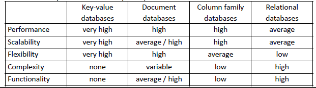

# H8 - NoSQL | [BACK](../README.md)

## Types of NoSQL Databases

### Key-value stores

- Simplest form of NoSQL database
- Data is stored in key-value pairs ON DISK
- Primary key access

- **Example**: Riak
    - persistent on disk
- **Example**: Redis
- **Example**: Memcached
    - Not persistent on disk
- **Example**: DynamoDB

- No ad-hoc queries

### Document stores

- Data is stored in documents
    - Each document is some complex data structure,
      like JSON, XML, BSON, …
    - Nowadays, most document stores use JSON
- These documents consist of components that
  each have a name and a value.
- Most adopted
- You can query the data and get a subset of the data

- **Example**: MongoDB
- **Example**: CouchDB

### Column-oriented stores

- Idk man
- Iets met kolommen

### Graph based databases

- Data is stored in nodes and edges
- Nodes are entities
- Edges are relationships between entities
- **Example**: Neo4j
- Used for social networks
- When you have a lot of many - to many relationships between entities

